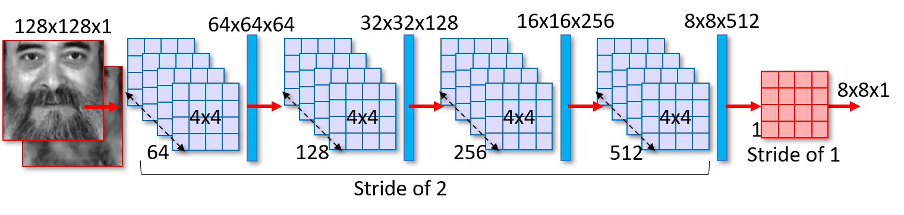

# Multi-Metric Evaluation of Thermal-to-Visual Face Recognition

Script provided is in relation with the following paper:

- K. Lai and S. N. Yanushkevich, [Multi-Metric Evaluation of Thermal-to-Visual Face Recognition](https://ieeexplore.ieee.org/document/8806202), in International Conference on Emerging Security Technologies, July 2019, pp. 1-6.

CycleGan Architure used in the paper:




Face Generated using cyclegan is evaluated using CNNs (Inception V3, Xception, and MobileNet) for face recognition (1:1 Verification).  For each CNN, a number of metrics are used for evaluating the performance, including "City Block", "Dice", "Squared", etc.
 
## Dataset
The experiment in this paper is based on the [Carl Dataset](http://splab.cz/en/download/databaze/carl-database). A description of the dataset can be found in:

*V. Espinosa-Duró, M. Faundez-Zanuy, and J. Mekyska, “A new face database simultaneously acquired in visible, near-infrared and thermal spectrums,” Cognitive Computation, vol. 5, no. 1, pp. 119-135, 2013*

*V. Espinosa-Duró, M. Faundez-Zanuy, J. Mekyska, and E. Monte-Moreno, “A Criterion for Analysis of Different Sensor Combinations with an Application to Face Biometrics,” Cognitive Computation, vol. 2, no. 3, pp. 135-141, 2010*

## Code
code cloned from https://github.com/eriklindernoren/Keras-GAN/blob/master/cyclegan

modified for thermal-to-visual application

## Setup
Libraries:
- numpy 1.18.1
- keras 2.2.4
- tensorflow 1.13.1

## Usage
To train and generate images:
```
python3 cycleCarl.py
```
